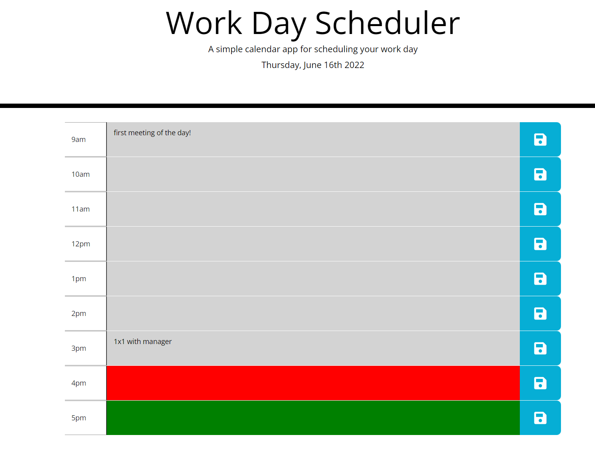

# Work Day Scheduler Starter Code

This is a calendar to help  schedule your work day!

When you load the webpage, you will be met with a daily calendar.

The current date will be displayed at the top, along with a work day scheduler
which consists of typical workday time slots

The time that has already passed will be shown as grey,
The current hour will be shown as red,
and the future hours will be shows as green

When a time slot is clicked on, a user can input text and create an item for that time block

When a user clicks the save button to the right of the time block they wish to save, that data will be saved and will be there the next time the web page is loaded. 

Here is a photo of the application, at 4:52 pm, so the 4pm time slot is red.

Deployed application can be found here:
https://beccadoan.github.io/super-disco/